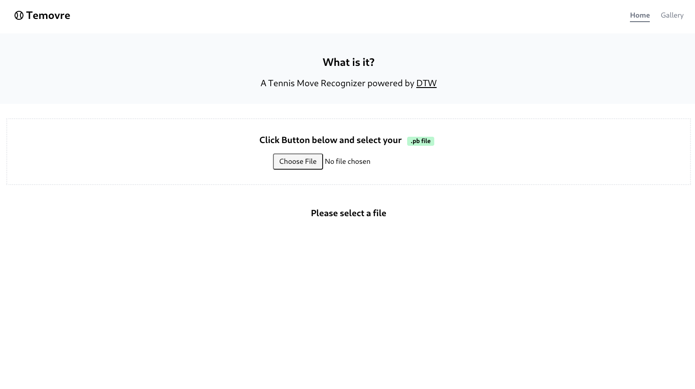
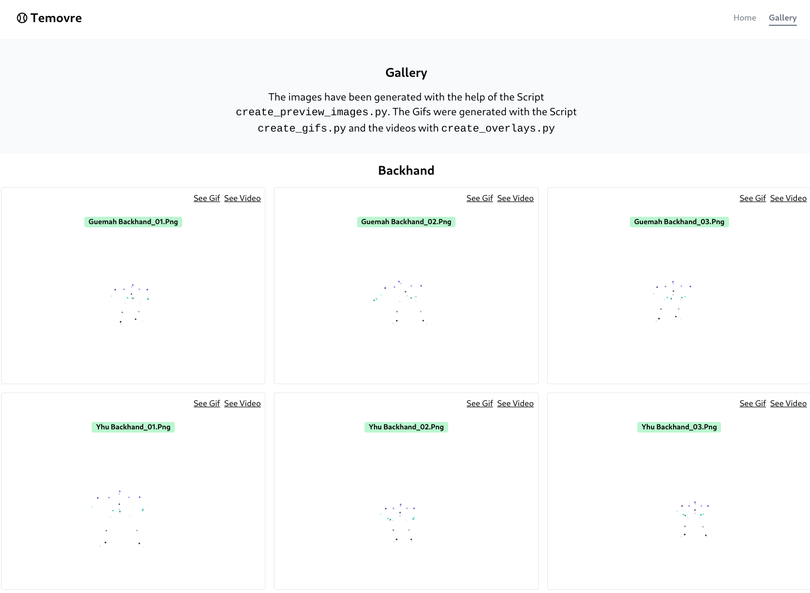

<div align="center">
    <h1>:tennis: Tennis Move Recognizer (Temovre)</h1>
    <h2>Detecting Tennis Moves with DTW Algorithm</h2>
    <p>The purpose of this project is to provide a model that can distinguish between
different Tennis moves, henceforth the name `temovre` (Tennis Move Recognizer).
The project was done in collaboration with the company Subsequent during the
module Scientific Visuliazation @ FHGR.</p>
    <br/>
    <br/>
    
    
</div>

## Python Scripts

| Script                   | Purpose                                                                                                                                                         |
| ------------------------ | --------------------------------------------------------------------------------------------------------------------------------------------------------------- |
| create_gifs.py           | Generates GIF Files from Matplotlib                                                                                                                             |
| create_overlays.py       | Generats Video Overlays where the individual keypoints are visible. In order for this to work please make sure that you have `ffmpeg` installed on your system. |
| create_preview_images.py | Extracts the first keyframe from the created gifs and creates a preview image as a PNG File.                                                                    |

### Running the Scripts

In order to run the Scripts a virtual environment needs to be created and the
necessary packages need to be installed:

```bash
python -m venv ./venv
source venv/bin/activate.sh
pip install -r requirements.txt
```

## Jupyter Notebook

In order to explore the data in more depth we have created a Jupyter Notebook in
order to run it do the following commands:

```bash
cd jupyter_notebooks
python -m venv ./venv
source venv/bin/activate.sh
pip install -r requirements.txt
python -m ipykernel install --user --name=venv
jupyter notebook ./
```

Next a Browser Tab should open. Then you can select the `dtw` Jupyter Notebook.

> Important: Please do not forget to select the installed `venv` as the kernel
> in order to utilize the installed virtual environment in the Jupyter Notebook.

## Frontend

The Frontend is build with the awesome
[Deno Fresh Framework](https://fresh.deno.dev/). Therefore in order for things
to work please make sure you have
[Deno](https://docs.deno.com/runtime/manual/getting_started/installation)
installed.

After that to start up the frontend simply run:

```bash
cd frontend
deno task start
```

Please note that you can configure the Url for the API Endpoint in the `.env`
file under the `frontend` directory.

```bash
API_URL=http://localhost:6969
```

## Backend

For the Frontend a simple Backend was implemented with
[FastAPI](https://fastapi.tiangolo.com/). The Backend just has a single
Endpoint. The purpose of this endpoint is to determine the correct Tennis Move
given a `.pb` file which can be uploaded via the frontend.

To start the backend simply run the following commands:

```bash
cd backend
python -m venv ./venv
source venv/bin/activate.sh
uvicorn app:app --port 6969 --reload
```

> Please note that the Port you specify should match the one you have in the
> `.env` file under the `frontend` directory.

## Used Ressources

| Ressource                                                                           | Description                                                                            |
| ----------------------------------------------------------------------------------- | -------------------------------------------------------------------------------------- |
| [Dynamic Time Warping Tutorial Series](https://www.youtube.com/watch?v=ERKDHZyZDwA) | An awesome YouTube Tutorial Series which explains Dynamic Time Warping in more Detail. |
